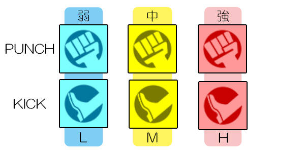
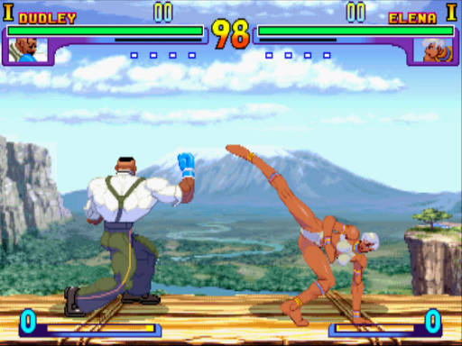
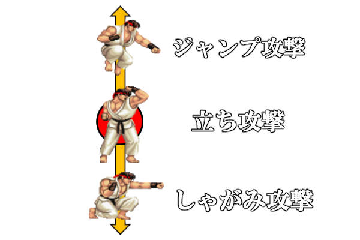
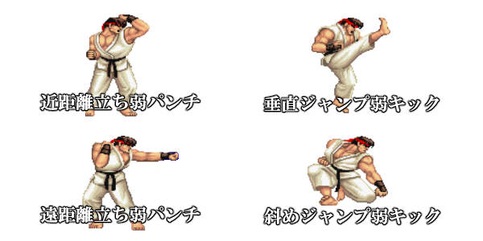
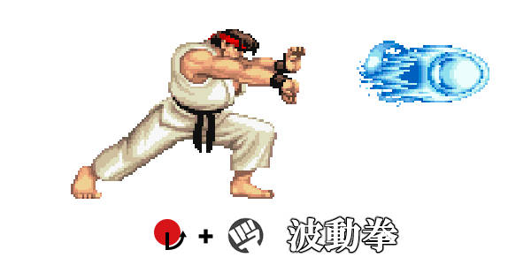
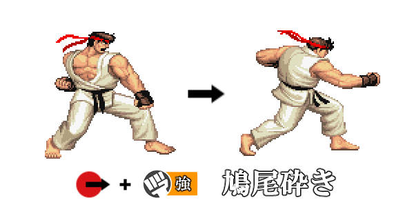
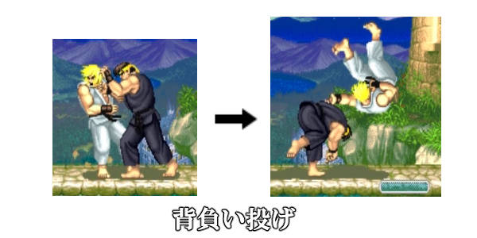

# 第4课：操作方法与基础知识：攻击篇

大家好，我是《街头霸王》系列讲座的讲师，Mr. Skill Smith，也就是bug。
今天我们将继续讲解操作方法和基础知识，主要是关于攻击部分的内容。
这次的重点不是机制，而是关于攻击的分类和一些基本概念。

---

### **普通技：普通攻击**

在上一次的讲座中，我们提到按钮就是攻击。按下按钮就能使出的攻击被称为“普通技：普通攻击”。
在《街头霸王》主系列中，拳击攻击和踢击攻击各有3种强度（弱、中、强），共计6种。

* **拳击**对应上段攻击，**踢击**对应下段攻击。
* 从左到右，按钮的强度逐渐增加。

按下拳击按钮就是拳击，按下踢击按钮就是踢击，这是基本规则。但根据角色的战斗风格，有时会有变化。
例如，拳击角色即使按下踢击按钮也可能使用拳击攻击，而卡波耶拉角色即使按下拳击按钮也可能使用踢击攻击。

* **达德利（Dudley）**使用强踢击，**埃琳娜（Elena）**使用强拳击。

攻击强度越高，伤害越大，但动作幅度也越大，因此如果没能准确命中，容易露出破绽。
拳击和踢击的动作以及强度带来的重量感，因角色性能差异较大，所以这里只是作为基础知识了解即可。

---

### **状态相关的普通技**

普通技可以从移动篇中提到的三种状态中使出：

1. **站立（包括行走）**
2. **蹲下**
3. **跳跃**
   每种状态都有专属的招式。
   

* **站立弱拳** 、**蹲下强踢**等，都是通过状态和按钮组合来命名的。
* 在格斗游戏玩家中，通常会使用更简化的表达方式，比如“立小拳”“下大踢”等。

此外，根据游戏标题或角色不同，还可能存在以下分类：

* **近距离/远距离**
* **垂直跳跃/斜向跳跃**
  这些也会影响招式的表现。

---

### **必杀技**

除了通过单一按钮使出的普通技外，角色还可以通过特定的摇杆输入和按钮组合使出的固有招式被称为“必杀技”。

* 必杀技需要多个摇杆输入，这种输入方式被称为“指令”。
* 必杀技比普通技更复杂，性能也更强大，后续会有专门的讲座深入讲解。

---

### **特殊技**

特殊技是需要指令的固有招式，但指令相对简单，通常只需要一个方向输入和一个按钮。
例如：“→ + 强拳”。

特殊技介于普通技和必杀技之间，性能上通常具有独特的优势，比如可以在移动中攻击。

---

### **投技**

投技是近距离抓住对手并造成伤害的特殊攻击，所有角色都具备。

* 投技可以破解防御（即“格挡”），是重要的进攻手段。
* 投技分为“普通投”和“必杀投”，后者需要特定的指令。

---

### **系统相关的攻击**

除了上述攻击类型外，还有一些需要消耗特定资源的攻击，例如使用能量槽的招式。
这些攻击通常是普通技、必杀技、特殊技和投技的延伸，建议在掌握基础后再深入学习。

---

### **术语解析：普通技的称呼方式**

普通技的命名通常由状态、强度和攻击类型组合而成，以下是常见的简化表达：

#### **状态相关**

* **站立** ：立、近、远
* **蹲下** ：下、屈
* **跳跃** ：跳、垂直、斜

#### **强度相关**

* **弱** ：小
* **中** ：中
* **强** ：大

#### **攻击类型相关**

* **拳击** ：拳、P
* **踢击** ：K、足

例如：

* “下大拳” = 蹲下强拳
* “跳中K” = 跳跃中踢

---

### **总结**

《街头霸王》系列的普通技种类繁多，掌握起来有一定难度，但也充满了探索的乐趣。
希望大家能通过练习逐步熟悉这些招式，并在实战中灵活运用。
下一讲我们将进入“操作方法与基础知识：防御篇”，敬请期待！
