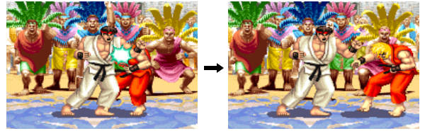

# **第5课：操作方法与基础知识：防御篇**

大家好，我是 **Street Fighter Seminar（街霸研修班）**的讲师， **Mr. Skill Smith** ，也就是**bug** 。
这次，我们将深入讲解 **防御的基础知识** 。

每款格斗游戏的防御系统都会有所不同，但本次讲解将 **专注于“防御（Guard）”的基本概念** ，这一机制是几乎所有2D格斗游戏的核心防御系统。

---

## **如何进行防御（Guard）**

对**新手**来说， **“防御”是一个非常难掌握的概念** ，因为它不像攻击那样直观。
是否能够正确防御，是迈入格斗游戏的 **第一道门槛** ，所以本次讲解会尽量 **拆解概念，深入浅出** 。

### **防御的基本规则**

在《Street Fighter》系列中，战斗采用**1V1**对战形式， **双方角色始终面对面** 。
此时， **将方向键往远离对手的方向推，即可进入防御状态** 。

例如： **隆（Ryu）向←推方向键，肯（Ken）向→推方向键，即进入防御状态** 。

大部分游戏说明书只会提到这里，但对于完全没玩过的人来说，这种描述仍然很难理解。

### **更易理解的描述**

实际上， **只要方向键始终往远离对手的方向推着，就会“自动”防御** 。

这里的**“自动”**非常重要，因为这意味着：

> **“如果你一直按住后方向，就会持续处于防御状态。”**

不过， **防御方式有不同种类，且并非所有攻击都能防御** ，所以 **光是一直按住后方向并不能做到完美防御** 。
接下来，我们会更深入地解析防御的种类和防御的限制。

---

## **防御的效果**

防御的效果取决于攻击的类型，之前的**“攻击篇”**已经介绍过攻击的分类，这里我们结合防御的角度再复习一次。

| **攻击类别**                                   | **防御效果**                        |
| ---------------------------------------------------- | ----------------------------------------- |
| **普通技（Normal）/ 特殊技（Command Normal）** | 防御后不受伤害                            |
| **必杀技（Special Move）**                     | 防御后受到少量“削减伤害（Chip Damage）” |
| **投技（Throw）**                              | **无法防御**                        |

#### **1. 普通技 / 特殊技 → 完全防御（No Damage）**

只要成功防御普通技或特殊技， **不会受到任何伤害** 。

> **（※ 但在《Street Fighter V》中，由于“白伤（Gray Damage）”的存在，情况有所不同，这里暂时不展开讨论。）**

#### **2. 必杀技 → 受到削减伤害（Chip Damage）**

防御必杀技时，虽然不会受到全部伤害，但仍会受到一部分削减伤害，通常是 **原本伤害的1/4以下** 。

* **这一伤害被称为“削减伤害（Chip Damage）”** ，简称**“削（けずり / Chip）”**。
* 在对局中，我们常听到**“被削死了”**（指因防御必杀技而被耗尽最后一点HP）。

#### **3. 投技 → 无法防御（Unblockable）**

 **投技无法通过防御来避免** ，必须使用 **其他方式应对（如拆投、跳跃、回避等）** 。

> 投技的防御方法将会在后续的**“投技篇”**详细讲解。

此外，为了 **区分“可以防御的攻击”和“无法防御的投技”** ，我们会把前者 **统称为“打击技（Strike）”** 。
不过，某些角色或特定游戏机制中，可能会出现**“无法防御的打击技” **或** “可以防御的投技”**，这些属于例外情况，将在后续细讲。

---

## **防御适用的基本状态**

角色的基本状态分为**站立、蹲伏、跳跃**三种，在“攻击篇”中，我们已经讲解过 **三种状态均可出招** 。
但在《Street Fighter》正统系列中， **防御仅能在站立或蹲伏状态下进行，跳跃中无法防御** 。

> **（※ 例外情况：《Street Fighter ZERO》系列等部分游戏允许“空中防御（Air Guard）”）**

#### **跳跃 = 无法防御**

在“移动篇”中曾提到， **跳跃是无防备状态** ，因此胡乱跳跃容易被对手针对。
相对地，如果对手喜欢无脑跳，你就可以用**对空技**进行惩罚。

---

## **防御的两种类型**

### **1. 站立防御（Standing Guard / 高防）**

 **操作方式** ： **输入“后方向”** （← 或 →）

站立防御的特点如下：

1. **可防御“上段”和“中段”攻击** 。
2. **如果对手未攻击，角色会向后移动** （因站立防御的输入和后退相同）。

> **注意** ：
>
> * 站立防御无法防御“下段攻击”！
> * 由于后方向同时会触发后退，因此 **无法原地持续站立防御** 。

---

### **2. 蹲伏防御（Crouching Guard / 低防）**

在蹲伏状态下进行防御被称为 **蹲伏防御** 。
 **操作方式** ： **输入“斜后下方向”** （↙ 或 ↘）

蹲伏防御的特点如下：

1. **可防御“上段”和“下段”的攻击** 。
2. **即使对手没有发动攻击，角色也不会移动** 。

> **说明** ：
>
> * 由于蹲伏防御可以抵挡地面战斗中的大多数攻击，同时角色不会自动移动，因此在许多情况下，它是非常实用的防御方式。

---

### **3. 攻击的“防御属性”**

正如在“站立防御”和“蹲伏防御”部分所提到的，每种攻击都具有特定的 **防御属性** ，而玩家必须选择合适的防御方式来进行应对。

* **【上段】** → 可以用**站立防御或蹲伏防御**来抵挡。
  * 绝大多数地面攻击都属于**上段属性**攻击。
* **【下段】** →  **只能用蹲伏防御来防御** 。
  * 例如地面的 **低踢** （尤其是蹲踢），通常都属于 **下段属性攻击** 。
* **【中段】** →  **只能用站立防御来防御** 。
  * 例如所有的**跳跃攻击**通常都属于 **中段属性攻击** 。

> **可能的疑问** ：
>
> * 许多新玩家可能会疑惑：**“为什么‘上段’和‘中段’的命名不是反过来的？”**
> * 这确实容易让人误解，但由于历史原因，这些术语已经成为格斗游戏的通用叫法，所以建议直接记住这个设定。

#### **防御属性与防御方式的关系**

从属性来看，大多数地面攻击都是**上段或下段**攻击。
所以，最基本的防御策略是：

✅ **“如果对手在地面上，就一直蹲伏防御；如果对手跳起攻击，就切换为站立防御。”**

在双方都处于地面状态时，除非你在 **走动、进行站立攻击或输入指令** ，否则 **一直保持蹲伏防御基本不会有问题** 。

尽管某些地面攻击带有 **中段属性** ，但通常这类攻击属于 **角色的特殊技** ，你可以在熟悉游戏后再专门研究如何应对。

“隆”（Ryu）的**“锁骨割”**（Sakotsuwari）是一个典型的**地面中段攻击**，它不能用蹲伏防御防住。

---

### **4. 空防（Fake Guard / からガード）**

当你在距离对手较远的位置输入防御指令时，角色会做出 **防御动作** ，即使攻击并未实际命中。

在此情况下，角色虽然 **没有被击中** ，但仍然做出了 **防御动作** ，这种现象被称为**“空防”**（Fake Guard / からガード）。

#### **为什么会有“空防”机制？**

从**站立防御的操作方式**来看， **“站立防御”和“向后移动”输入方式相同** 。
如果没有“空防”机制，玩家在尝试站立防御时，可能会因为 **后退动作而完全回避攻击** ，导致游戏失衡。

例如：

* 如果“空防”不存在，玩家可以通过**后退**来 **规避波动拳（Hadouken）等飞行道具** ，这对进攻方和防御方都不太公平。
* 但**“空防”机制让角色在防御指令输入时不会移动，从而确保防御系统的合理性**。

---

### **5. 无法防御的情况**

除了跳跃时无法防御以外，以下几种情况也会导致 **无法防御** 。

#### **① 角色正在出招时**

在 **攻击动作执行完毕之前** ，角色是无法进行防御的。
这也是为什么**空挥大招（Whiff Punish）**会带来巨大风险的原因。

* 如果你贸然使用大招但没有命中，就会暴露在对手的 **反击** （Punish）之下。

#### **② 被击中时**

当角色被攻击命中后，会进入 **受创硬直状态** ，此时无法进行防御。
受创时间的长短取决于攻击的类型。

* 角色受到攻击后会出现**硬直、后仰或倒地**等状态，这段时间内无法进行防御。

#### **连击的衔接**

* 如果对手在你的受创状态结束之前 **成功接上下一击** ，那么你就会 **持续挨打** ，进入连击状态。
* 这也是连招（Combo）的基本原理。

---

### **6. 课程总结**

本次讲解了防御的基础概念，包括：
✅  **蹲伏防御的使用方式及特点** （可防御上段和下段攻击）。
✅  **攻击的防御属性** （上段、中段、下段的防御方式）。
✅  **如何正确选择防御方式** （地面对战时蹲伏防御，面对跳跃攻击时站立防御）。
✅  **空防机制的作用** （防止玩家通过后退躲避攻击）。
✅  **哪些情况下无法防御** （出招时、被击中时）。
