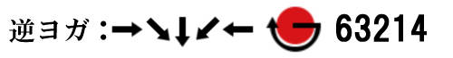
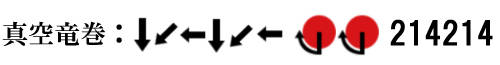

大家好，我是Street Fighter研修班的讲师——Mr.技能匠，也就是bug。
本次课程将围绕攻击篇中稍微提到过的“指令”进行基础讲解。

理解指令对于自由释放必杀技至关重要，因此尽管这是基础篇，但信息量会相当庞大。
请大家先慢慢阅读，并在实际游玩时，从需要的部分开始复习会更有效果。

**什么是指令**
在攻击篇中稍微提到过，指令指的是那些需要进行特定输入才能释放的技能的特殊输入本身。

需要指令的技能基本上都是专属动作，而在指代整个类别时，我们通常称之为固有技。不过，这个词在实际使用时并不常见。

**关于指令的默认规则**
在指令列表中，通常只会直接列出指令，而不会额外说明输入条件。
但如果指令前没有写明“空中”或“跳跃中”，则默认情况下该指令是在地面上输入的。

此处所指的“地面”，通常包含站立和蹲伏两种状态，也就是说，这些指令可以在站立或蹲伏状态下释放。

此外，指令列表中可能会附有注释，例如：“※指令基于角色面向右侧时的方向。”
这句话其实表达得不够完整。

完整的含义应该是：

“当角色面向左侧时，指令的左右方向会反转。”

指令的左右反转
如下图所示，角色的朝向决定了指令的左右方向是否发生反转。

实际上，与其说是“左右反转”，不如理解为镜像翻转可能更直观。
指令方向会随角色朝向实时同步，当对战中角色换位时，双方的指令方向也会立即翻转。

因此，各种指令都需要熟练掌握从两个方向输入的能力。

**数字键盘（NumPad）标记法**
在格斗游戏圈子里，我们有时会看到指令不是以方向键表示，而是数字+按键的方式，比如“236+P”。

这种标记法起源于文本中难以输入斜向箭头的情况，因此，开发者们用PC键盘的**数字键盘（NumPad）**来表示摇杆输入方向。

如下图所示（tenkey.jpg），数字5代表中立（不输入方向），而其余八个数字分别对应八个方向：

2 = 向下
6 = 向前
4 = 向后
8 = 向上
9 = 右前上（斜向上）
7 = 左前上（斜向上）
3 = 右前下（斜向下）
1 = 左前下（斜向下）

这种方式刚开始可能会不太直观，但本次讲解会同时列出传统方向标记和数字键盘标记，可以趁此机会一起记住。
我自己当时就是这样学会的。

**特殊技的主要指令体系**
特殊技（特殊攻击）主要分为两种指令类型：

① 单一方向+按键
② 按键同时按下

① 单一方向+按键 是最常见的特殊技指令类型。
在输入该类指令时，必须在按下按键时仍保持方向键输入。
如果输入方式是先推方向再松开，然后才按按键，这样是无法触发技能的。
正确做法是：先输入方向，并保持住，然后在合适的时机按下按键。

② 按键同时按下 是最直观的一类指令。
只要同时按下指定的按键，技能就会触发。

**“单指令技”（ワンコマ）**
在本次介绍的这些一步完成的指令，通常被称为**“单指令技”（ワンコマ），即“单指令（ワンコマンド）”的缩写**。

比起需要多次输入的指令技，单指令技更快、更容易使用，可以瞬间反应并释放技能。
在实际对战中，“单指令对空”（ワンコマ対空）是一个常见术语，指的是具有良好对空能力的普通攻击。

必杀技的主要指令体系及相关内容
必杀技的指令主要分为以下四种：

① 多次输入方向+按键
② 长按一个方向后，输入指定方向+按键
③ 按键同时按下
④ 按键连续按压

① 多次输入方向+按键 这种类型的技能通常称为**“指令技”**（コマンド技），也是最常见的必杀技输入方式。

② 长按一个方向后，输入指定方向+按键 这种类型称为**“蓄力技”（タメ技），因为需要先长按（蓄力）一个方向后再输入最终指令**。

③ 按键同时按下 这种情况比较特殊，有时同一个指令可能会被归类为特殊技或必杀技，具体分类依据技能的性能。

④ 按键连续按压 这种类型的技能，只需快速连续按键就能触发。
不过，尽管指令简单，但由于可能需要很高的按键连打速度，或无法直接释放（通常会先出普通攻击），所以要灵活掌握并不容易。
或许你会问：“蓄力技不也是指令技吗？”

从广义上讲是的，但实际上，游戏中的角色通常以“指令技型”或“蓄力技型”来区分，因此在称呼上也进行了区分：

以指令技为主的角色被称为**“指令角色”（コマンドキャラ）**
以蓄力技为主的角色被称为**“蓄力角色”（タメキャラ）**
例如，隆（リュウ）是指令角色，而盖尔（ガイル）是蓄力角色。

### **指令的机制与输入技巧**

指令是按照指定的输入顺序，从左到右依次输入完成的。

以波动拳为例，就是**“下 → 右下 → 右 + 拳”**。

无论是哪种指令类型，只要是需要多个输入的招式，都遵循这样的规则。

#### **输入指令的基本技巧**

输入指令时，不要逐个确认“下 → 右下 → 右...”，而是 **将整个指令作为一个整体动作来操作** 。

最近的指令表不仅仅是用箭头表示，很多游戏也会使用更具象化的**动作图标**来表示指令。

比如像这样，手柄的摇杆从下方向右前方划出的动作。

指令必须在一定时间内完成，但其实 **不需要特别用力或急迫地输入** 。

保持轻松、冷静、自然地完成输入，是成功率提高的关键。

必杀技指令通常是**最后一步的方向输入+按键**同时按下，但和某些特殊技不同的是， **必杀技的输入允许一定的缓冲时间** 。

也就是说，在完成最后一步方向输入后，即使稍微偏离或稍微延迟按键输入，依然可以成功释放技能。这个缓冲时间大约在 **10帧左右** ，掌握这一点会对指令的稳定性产生很大帮助。

如果误以为“最后必须同时按下”，很容易导致还没完成方向输入就提前按下按键，从而导致输入顺序错误，招式无法释放。

所以， **与其想着“下 → 右下 → 右 + 拳”** ， **不如按照“下 → 右下 → 右 → 拳”这种顺序来理解** ，即 **先完成指令，再按按键** ，这样反而更容易成功。

---

### **指令的通称与解析**

指令通常会根据经典的代表性招式来命名，例如**“下 → 右下 → 右” **被称为** 「波动指令」**。

需要注意的是，指令的通称通常 **不包含按键部分** ，只表示 **摇杆输入** 。

例如，波动拳使用 **拳键** ，但如果是使用相同摇杆输入、但需要**脚键**的技能，就可以称之为**“波动脚”**，以示区分。

接下来，我们将介绍常见的指令通称，并提供一些输入技巧。

图片的排列方式是：「指令通称：箭头表示・图标表示・数字键盘表示」。

另外，所有指令的方向都是基于**角色面向右侧**的情况。

---

### **常见指令通称**

#### **波动指令（波动拳）**

所有指令中最基础的指令。

从**下方向前旋转，再按键**的操作，但有个常见的失误就是 **摇杆输入过度，导致误触斜上方向，角色跳跃** 。

要特别注意 **在前方向止住输入** ，避免失败。

#### **逆波动指令（竜巻旋风脚）**

因“竜巻旋风脚”而得名的指令。

它与波动指令相反，即 **向后旋转到前** ，但同样容易出现**摇杆输入过度**的问题，需要特别注意。

如果能够熟练掌握 **双向波动指令** ，那么 **波动拳和竜巻旋风脚都能稳定输入** 。

#### **升龙指令（昇龙拳）**

最难掌握的基础指令之一。

一个常见的输入技巧是： **“先前，再波动”** 。

有人可能会担心这样会不会触发波动拳，但实际上，由于 **昇龙拳的技能优先级更高** ，即使波动指令也被输入，系统仍然会判定为 **昇龙拳** ，所以不用担心。

#### **逆升龙指令**

“逆昇龙”是“昇龙拳”指令的反方向版本。

和波动&竜巻的关系一样，只要熟练掌握双向输入，就可以稳定释放。

*关于“昇龙拳”和“昇竜”表记的区别：*

「昇龍拳」是正式的技能名称，所以使用「龍」字。

而“昇竜”这种写法更偏向玩家之间的习惯性表达，因此采用了「竜」字。

#### **瑜伽指令（ヨガフレイム）**

因“ヨガフレイム（瑜伽火焰）”而得名的指令。

从**后方向前旋转**的半圆输入。

与波动指令一样，需要避免误触斜上方向跳跃，同时注意**←・↓・→的明确输入**，有时候斜向输入不必刻意去按，系统也会自动识别。

#### **逆瑜伽指令**

逆方向的瑜伽指令。

与逆昇龙、逆波动一样，只要掌握了双向输入即可稳定释放。

*补充：*

最近版本的达尔锡姆（ダルシム）将 **ヨガフレイム的指令改成了逆瑜伽** ，以防止与ヨガファイア（波动拳类技能）产生误操作。

但 **通称仍然维持为“ヨガ”** ，因此可能会出现**「ヨガフレイム的指令是逆ヨガ」**这样的奇怪对话，但这就是传统，不必介意。

#### **一回转指令**

直接称为“一回转”会比用技能名表达更直观。

**摇杆360°旋转**即成立，不分左右方向。

输入时包含**↑方向**，但角色 **不会跳跃** ，背后的机制较复杂，后续章节会详细讲解。

#### **真空波动指令**

因「真空波动拳」而得名。

**波动指令×2**的输入方式，多用于 **超必杀技** 。

因输入较长，需要练习才能稳定输入，关键是 **控制好↓和→的两次输入** ，避免过度或不足。

#### **真空竜巻指令**

ZERO系列的“真空龙卷旋风脚”

从**真空龙卷旋风脚**开始说起吧。

如果**真空波动拳**可以简称为“真空”，那么**真空龙卷旋风脚**要怎么简称呢？

从语言习惯来看，如果只说“真空”，一般是指 **真空波动拳** ，而**真空龙卷旋风脚**的话，至少要说到“真空龙卷”才能让人明白。

这是一种需要靠语感来理解的微妙区别，确实有点让人困惑。

不过，本质上， **真空龙卷旋风脚的指令只是“真空波动拳”的反向输入** 。

因此，练习的重点就是 **让自己无论面对哪个方向都能熟练使用真空波动拳** 。

当然，还有一些更加复杂的大招指令，例如**逆向瑜伽火（逆ヨガ2回，即“↓↘→↓↘→”）**等。

但对于基础指令而言，掌握到这里的内容就基本够用了。

---

### 关于蓄力指令的俗称

相比其他指令， **蓄力指令很少用技能名称来代称** 。

这是因为蓄力的方向基本只有两种，即 **横向蓄力（后蓄力）**和**下方向蓄力** ，所以直接说“横蓄”或“下蓄”就能快速传达意思，大家也都能理解。

### 关于蓄力的“时间”

蓄力完成所需的时间因游戏、角色和招式而异，但无论是横向蓄力还是下方向蓄力，通常不会超过整整1秒（60帧）。当蓄力完成后，玩家并不需要立刻释放招式，只要继续保持蓄力方向，蓄力状态就会持续。因此，建议先练习稳定地蓄力至少1秒以上，以确保能够成功释放招式。

---

### 关于蓄力的“方向”

正如前文所述，蓄力基本分为“横向蓄力（后蓄力）”和“下方向蓄力”两种。在指令列表等地方，通常会用“←蓄力”或“↓蓄力”来表示蓄力方向。然而，蓄力实际上也包括斜向的输入。

具体来说：

* **横向蓄力** 可以是「纯后（←）」、「后斜上（↖）」、「后斜下（↙）」三个方向。
* **下方向蓄力** 可以是「纯下（↓）」、「前斜下（↘）」、「后斜下（↙）」三个方向。

这里有一个值得注意的点：

“后斜下（↙）”同时属于横向蓄力和下方向蓄力的范围。换句话说，将摇杆保持在后斜下（↙）的位置时，可以 **同时蓄力横向和下方向的招式** ！

这是游戏说明书不会告诉你的惊人事实。

此外，后斜下（↙）还有另一个重要的功能——它是**蹲防**的方向。

也就是说，在进行蹲防的同时，也在 **自然地进行横向蓄力和下方向蓄力** 。

---

### 关于蓄力的“可能范围”

蓄力在哪些状态下可以进行？

简单来说，**任何时候都可以**蓄力。

无论是 **攻击中、被攻击中、跳跃中、格挡中，甚至倒地中** ，都可以保持蓄力。甚至在 **回合开始前** ，玩家就已经可以开始蓄力。

所以，最好的习惯就是 **随时把摇杆放在后斜下（↙）的位置** 。让它成为肌肉记忆完全没有坏处。

---

### 关于蓄力的“解除条件”

那么，蓄力状态**何时会被解除**呢？

答案很简单： **当摇杆移动到蓄力方向以外的位置时，蓄力就会被解除** 。

蓄力指令的输入方式通常是“先蓄力，然后输入相反方向并按键释放”。因此，当玩家执行招式时，蓄力就自然会被解除。此外，如果玩家 **不得不向前斜方向移动，或者摇杆回到中立（不输入方向）** ，蓄力也会被取消。

有一个需要特别注意的情况：

横向蓄力（←）是朝着相反方向输入的，如果对手跳到玩家身后导致 **站位反转** ，那么蓄力也会瞬间被解除。理论上，玩家可以在对手跳跃跨越的瞬间迅速调整摇杆方向，以保持蓄力状态，但这在实战中基本不可行，属于高难度的炫技操作。

另一方面，如果摇杆仍然 **停留在蓄力方向内** ，即使进行细微的调整，蓄力仍然会保持。例如， **横向蓄力可以从纯后（←）无缝移动到后斜下（↙），蓄力不会被中断** 。

有一点需要额外说明：

虽然一般来说蓄力方向的释放可以是三个方向（例如横向蓄力可以解放为→、↗、↘），但部分游戏有 **特殊限制** 。最典型的情况是：

* **横向蓄力的释放方向不能是前斜下（↘）** 。
* 这是为了防止玩家在 **保持下方向蓄力的同时还能释放横向蓄力招式** ，因为这可能会导致一些不平衡的问题。

另外，如果某些招式 **要求特定的斜方向蓄力** ，那么蓄力和释放必须严格按照指令执行。例如：

* 如果招式要求“左下蓄力（↙）”，那么 **纯左（←）不能蓄力** 。
* 如果招式要求“右下释放（↘）”，那么 **纯右（→）不能触发招式** 。

---

### 关于蓄力型大招的指令

蓄力型大招的输入方式，例如“←蓄力→←→+P”，也遵循前述的蓄力规则。尽管不同游戏对蓄力大招的机制有所不同，但通常可以按照以下步骤理解：

1. **先进行蓄力** （按住对应方向）。
2. **释放蓄力的瞬间，快速输入额外指令** 。
3. **在短时间内完成所有指令，否则输入失败** 。

蓄力大招的 **关键在于“解放蓄力后迅速输入剩余指令”** 。由于需要在短时间内完成多个方向输入，因此有些玩家可能会感到紧张和不习惯。克服的方法是 **保持冷静，专注于精准输入，而不是追求速度** 。

---

### 术语解释：~要素（~要素）

在描述方向输入时，游戏中有时会使用“要素”这个术语。

“要素”表示包含该方向及其斜方向的所有输入，例如：

* **上要素** → 纯上（↑）、右上（↗）、左上（↖）
* **下要素** → 纯下（↓）、右下（↘）、左下（↙）
* **右要素** → 纯右（→）、右上（↗）、右下（↘）
* **左要素** → 纯左（←）、左上（↖）、左下（↙）

例如，**“下要素中保持蓄力”**意味着可以在纯下（↓）、前斜下（↘）、后斜下（↙）任意一个方向进行蓄力。

此外，“左右”有时也会用“前后”来表示，例如“前要素”指的是纯前（→）加前斜上（↗）和前斜下（↘）。

---

### 总结

关于蓄力指令的基本讲解就到这里了！

我尝试把蓄力的各个细节全部整理在一起，希望能帮助大家更好地理解。

不过，学习指令的最佳方法还是从 **自己想玩的角色开始** ，确认该角色的招式表，并反复练习。

那么，我们下次讲解再见！
